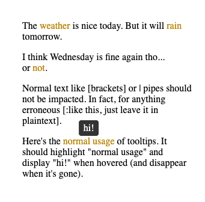

# Tooltip Annotation Language

A simple tooltip markup language that compiles to HTML classes that use CSS `content-attribute` tooltips.



The language spec can be found in [`lang.txt`](lang.txt).

The compiler is a simple Python 3.14 script that relies on regex and str.replace().

Examples can be found in the `examples/` folder. Compiling is done as follows:

```sh
# Run from project root
python3 code/compile.py examples/example1.txt sample.html
```

In fact, this command has already been run, and you can see [`out/sample.html`](out/sample.html) for yourself.

**Generative AI Statement**: Generative AI was used for early-stage planning and to help generate the tooltip CSS.

## Next Steps

- Make a less brittle execution entry point
- Support more features (possibly move from CSS to JS tooltips for more control)
